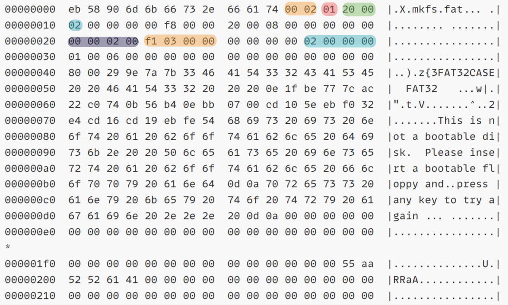

# Repair-FS Lab：多文件系统应急恢复

你会拿到一块虚拟磁盘，磁盘中有 3 个分区，分别使用 ext2、FAT32、NTFS。每个分区中都有一个被删除或被隐藏在元数据线索后的证据文件，包括 gzip 日志、zip 压缩包和 PNG 图片。你的任务是在救援系统中只读分析磁盘，恢复证据文件，提取其中的 flag。

预计用时：30 分钟左右。实验分 3 个阶段。

## 环境准备

教师会发放一个学生可见的 `bank/` 目录，其中包含全班的实验盘、校验文件和公开自测 manifest。你只需要在 `Makefile` 顶部把 `STUDENT_ID` 改成自己的 12 位学号，例如：

```makefile
STUDENT_ID ?= 522012345678
```

然后你的实验盘路径就是：

```text
bank/repair-fs-522012345678.qcow2
```

所有同学的磁盘结构相同，但证据文件名、文件内容和 flag 会随学号变化。不要交换镜像或答案。

你还需要自行下载 SystemRescue ISO：

```text
https://www.system-rescue.org/Download/
```

提供校内镜像下载（和上面链接中的一致）：

```text
Share content: systemrescue-13.00-amd64.iso
Link: https://pan.sjtu.edu.cn/web/share/db0fbe897a684be61084bf8dedb936dc
Extraction code: ng4v
```

### Ubuntu / Debian

安装 QEMU：

```bash
sudo apt update
sudo apt install build-essential qemu-system-x86-64 qemu-utils
```

启动救援系统：

```bash
make run ISO=<你下载的救援系统镜像ISO> SSH_PORT=<宿主机转发端口，默认50000>
# 例如
# make run ISO=systemrescue-13.00-amd64.iso
```

（30 秒内）启动界面必须选择 **`Boot SystemRescue with serial console (ttyS0,115200n8)`**。别急回车，下面配置 ssh 环境。

> [!IMPORTANT]
>
> 为了让宿主机用 `ssh` / `scp` 连接救援系统，在这个菜单项上按 `Tab` 编辑启动参数，在行尾追加：
>
> ```text
> nofirewall rootpass=repairfs
> ```
>
> 设置密码为 `repairfs`。启动完成后，可以从宿主机连接到救援系统：
>
> ```bash
> ssh -p 50000 root@127.0.0.1
> scp -P 50000 local-file root@127.0.0.1:/root/work/
> scp -P 50000 root@127.0.0.1:/root/recovered/file ./submissions/
> ```
>
> `SSH_PORT` 是宿主机上的转发端口；救援系统内的 `sshd` 仍监听 22 端口。如果启动时没有追加 `nofirewall rootpass=repairfs`，也可以在救援系统控制台中手动执行：
>
> ```bash
> iptables -I INPUT 3 -p tcp --dport 22 -m conntrack --ctstate NEW -j ACCEPT
> passwd
> ```
>

### macOS

Intel Mac 可以使用 Homebrew 安装 QEMU：

```bash
brew install qemu
```

Apple Silicon 也可以运行 `qemu-system-x86_64`，但这是跨架构模拟，启动会慢一些。建议分配 2G 内存即可；本实验磁盘很小，不需要高性能。

进入救援系统后，后续命令两种架构是相同的。

## 基本信息

进入 SystemRescue 后，先确认磁盘设备名。通常实验盘会是 `/dev/vda`，三个分区是 `/dev/vda1`、`/dev/vda2`、`/dev/vda3`：

```bash
lsblk -f
blkid
```

不要把实验分区以读写方式挂载。推荐先复制分区镜像，再对副本操作：

```bash
mkdir -p /root/work /root/recovered
# 把各个分区的数据完整复制到 /root/work 下的不同文件中，在副本上进行更改
dd if=/dev/vda1 of=/root/work/ext2.img bs=4M status=progress
dd if=/dev/vda2 of=/root/work/fat32.img bs=4M status=progress
dd if=/dev/vda3 of=/root/work/ntfs.img bs=4M status=progress
```

验证文件类型：

```bash
file /root/work/ext2.img /root/work/fat32.img /root/work/ntfs.img
```


## Phase 1:  ext2 误删文件恢复

**<u>目标分区</u>**：`/dev/vda1`，文件系统：ext2。

**<u>场景</u>**：一个日志压缩包（gzip 格式，可以被 `gzip -t <file>` 识别）被 `rm` 误删除。ext2 没有 ext4 journal，也不会像 ext4 那样依赖日志恢复 extent tree；被删除 inode 中通常仍有足够线索找到数据块。

**<u>你需要完成</u>**：

1. 在 ext2 分区副本上找出已删除 inode。
2. 根据 inode 恢复 gzip 格式的文件。
3. 解压文件并记录 `EXT2{...}`。

**<u>可能用到的工具</u>**：

```bash
# 检查指定磁盘文件/设备上被删除的文件节点
debugfs -R "lsdel" extDiskFile

# 检查指定磁盘文件/设备上的指定 inode 编号为 INODE（注意这里的尖括号不能去掉）的信息
debugfs -R "stat <INODE>" extDiskFile

# 将指定磁盘文件/设备上的指定 inode 记录的信息导出为新的文件
debugfs -R "dump <INODE> outputFile" extDiskFile

# 检查文件是否是合法的 gzip 格式文件
gzip -t aFile

# 解压并直接将文件内容输出到 stdout（不产生文件）
gzip -dc GZFile
```

**<u>观察重点</u>**：

- 阅读 `lsdel` 输出的 inode、删除时间、文件大小，思考 `lsdel` 可能的原理是什么；

- `stat <INODE>` 中包含哪些信息，是否还能看到 block 指针；


## Phase 2:  FAT32 目录项取证

**<u>目标分区</u>**：`/dev/vda2`，文件系统：FAT32。

**<u>场景</u>**：一个 8.3 短文件名的 zip 归档被删除，现在亟需你的恢复。这个 FAT32 卷模拟了一个反复拷贝、覆盖、删除文件的 U 盘；根目录里会有若干被删除的临时文件，目标文件名形状由可见提示给出。

**<u>相关知识</u>**：

- 回忆课上提到的 FAT32 文件系统中的 “扇区” 和 “簇” 的概念；
  - 扇区 Sector：硬件最小读写单位，标准 512 字节，磁盘 / U 盘一切寻址都以扇区为基准；
  - 簇 Cluster：FAT32 文件最小分配单位，由连续 N 个扇区组成（格式化决定，如 1 簇 = 8 扇区 = 4KB）。哪怕文件只有 1 字节，也要独占一整个簇。
  
- 回忆课上提到的 FAT32 文件系统的结构：FAT32 分区从 0 号逻辑扇区开始，按顺序硬性分成 4 大主区域和辅助 FSInfo 结构，顺序永远不变：
  - `[ 保留扇区区域 ] → [ FAT表1 ] → [ FAT表2(备份) ] → [ 数据区 ]`；
  
- 保留扇区区域（从第 0 扇区开始跨越多个扇区）记录了 FAT32 的元信息，同时用于引导 OS 正确读取和载入文件系统；它包含了如下的信息：

  | 偏移 | 长度 (bytes) | 字段名                | 功能                                     |
  | ---- | ------------ | --------------------- | ---------------------------------------- |
  | 0x00 | 3            | FAT32 标准跳转指令    | 引导跳转                                 |
  | 0x0B | 2            | 每扇区字节数          | 定义磁盘扇区大小 (通常 512 字节)         |
  | 0x0D | 1            | 每簇扇区数            | 定义文件分配的最小单位 (簇) 包含的扇区数 |
  | 0x0E | 2            | 保留扇区数            | DBR 及后续保留扇区总数 (FAT32 通常为 32) |
  | 0x10 | 1            | FAT 表数量            | 通常为 2 (主 FAT 和备份 FAT)             |
  | 0x20 | 4            | 总扇区数 (32 位)      | 卷的总扇区数 (大容量设备使用)            |
  | 0x24 | 4            | 每 FAT 扇区数 (32 位) | FAT 表占用的扇区总数                     |
  | 0x2C | 4            | 根目录起始簇          | 根目录所在的第一个簇号 (通常为 2)        |

  对应到一个 FAT32 的镜像 dump 的信息（小端序，例如 2 bytes `00 02` 表示 `0x0200`）：

  

- FAT32 中的一个目录项的结构（目录项中起始簇号由高 16 位和低 16 位拼成）：

  ```
  DIR_FstClusHI    起始簇号的高 16 位，目录项偏移 0x14，2 字节
  DIR_FstClusLO    起始簇号的低 16 位，目录项偏移 0x1a，2 字节
  DIR_FileSize     目录项所指文件的 bytes 大小，目录项偏移 0x1c，4 字节
  ```

- 标准 zip 文件的文件头 magic number 为 `50 4B 03 04`（小端序，hexdump 里面看起来像 `PK..`）；
- FAT32 删除文件时，**目录项第一个字节会被改成 `0xE5`**，目录项中的文件大小和起始簇号仍可能保留；FAT 表中的簇链则可能已经被清空；

**<u>你需要完成</u>**：

1. 找到被删除的 8.3 目录项。可见提示文件会告诉你文件名的大致形状，例如 `?OSTABCD.ZIP`；
2. 从目录项中读出起始簇号和文件大小；
3. 判断这个文件的数据有没有跨越多个数据簇，还是只在一个数据簇中；
4. 根据 FAT32 保留扇区区域信息计算数据区偏移，取出 zip 文件；
5. 解开压缩包中的 `field-note.txt` 并记录 `FAT32{...}`。

> [!TIP]
>
> 你可以通过读保留扇区区域的信息来得到根目录以及被删除文件所在的簇的位置，
> 
> 当然也可以合理利用 hexdump 中的文件特征（如 zip 的文件头）确定文件的位置（这样只需要在目录项中找到目标文件的大小即可，不需要计算了）。注意不要把同样处于删除状态的临时文件当成目标。可以留意 `hexdump` 中的 `Stage 2 visible` 相关字样。

**<u>可能用到的工具</u>**：

```bash
# 查看指定磁盘文件/设备中的一些元信息
fsck.fat -vn fat32DiskFile

# 将二进制文件读取为十六进制数码文本，并展示出来
hexdump -C binFile | less

# 从二进制文件/设备的 0xFFFA00 偏移处开始，选中大小 0x999 bytes 的数据导出到以 recovered.zip 为名称的文件中
dd if=binFile of=recovered.zip bs=1 skip=$((0xFFFA00)) count=$((0x999))
```


## Phase 3:  NTFS 文件记录恢复

**<u>目标分区</u>**：`/dev/vda3`，文件系统：NTFS。

场景：一张桌面取证图片被删除，flag 存在 PNG 的压缩文本块中。误删前系统里还发生过临时 trace 文件删除、文档覆盖和文件改名，所以 `ntfsundelete` 可能列出多个候选。NTFS 的核心线索在 MFT 文件记录中：文件名属性、数据属性、记录是否仍可恢复。你不需要手工解析完整 NTFS，但需要理解工具输出背后的含义。

**<u>你需要完成</u>**：

1. 列出 NTFS 中可恢复的删除记录。
2. 找到与你学号对应的 `incident_*.png` 文件记录。
3. 恢复 PNG 文件。
4. 读取 PNG 文本块并记录 `NTFS{...}`。

**<u>可用工具</u>**：

```bash
# 查看指定磁盘文件/设备中 NTFS 文件系统的基本信息
ntfsinfo -m ntfsDiskFile

# 列出 NTFS 中可恢复的删除记录
ntfsundelete ntfsDiskFile

# 将编号为 <INODE> 的被删除的文件恢复为指定文件
ntfsundelete ntfsDiskFile --undelete --inodes INODE --output file

# 查看文件的基本信息
file aFile

# 从指定图像文件中提取本阶段实验的 flag。extract_png_text.py 位于实验仓库中
python3 tools/extract_png_text.py pngFile
```

**<u>观察重点</u>**：

- MFT 记录号是否就是工具中显示的 inode。
- 文件名属性和数据属性是否仍然存在。
- 网络 / 大模型搜索一下，上述两条指令 `ntfsundelete` 背后的原理是什么？


## Submit

确保你的 `Makefile` 中正确地填写了你的学号 ID；

在你的提交目录（`submissions`）中放一个 `answer.txt`，包含三行 flags：

```text
ext2: EXT2{...}
fat32: FAT32{...}
ntfs: NTFS{...}
```

建议同时提交你恢复出的 3 个二进制证据文件（同样置于 `submissions` 下），以及简要叙述一下你的观察/思考（总字数控制在 500 字以内），方便助教复核过程。

你可以在本地自测得分：

```bash
make grade
```

执行下面的命令生成提交压缩包：

```bash
make submit
```


## 常见问题 Q&A

#### `/dev/vda` 不存在？

先运行 `lsblk -f`。如果你的 QEMU 使用 IDE/SATA，磁盘可能叫 `/dev/sda`。

#### `debugfs dump` 报错？

确认你传入的是尖括号 inode，例如 `<13>`，并且操作对象是 ext2 分区副本，不是整块磁盘。

#### FAT32 算偏移时结果不对？

检查多字节字段是否按 little-endian 解释。目录项中的起始簇号不是连续 4 字节，而是高 16 位和低 16 位分开放。

#### `ntfsundelete` 找不到文件？

确认你在操作 `/root/work/ntfs.img`。如果你直接挂载过 NTFS 分区并写入，可能会改变删除记录；重新从 `/dev/vda3` 复制一份副本再试。

#### 只找到了证据文件但不知道 flag？

根据文件类型处理：gzip 用 `gzip -dc`，zip 用 `unzip -p`，PNG 用 `tools/extract_png_text.py` 或能读取 PNG `zTXt` 块的工具。
